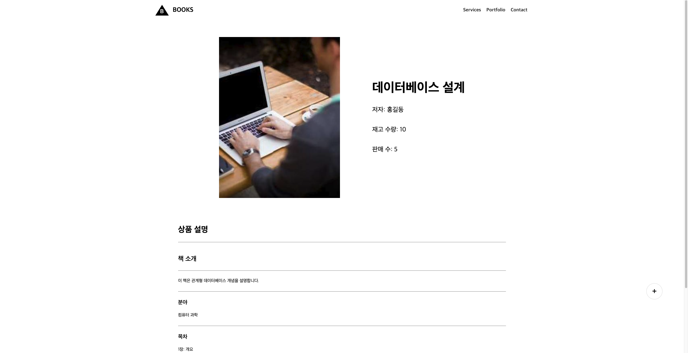

# 온라인 서점 북북

## 실행 방법

### 프로젝트 클론

git clone https://github.com/Jung-sunghoon/bookstore_project.git

### 의존성 설치

yarn add

### 개발 서버 실행

yarn dev

## 프로젝트 소개

### React, TypeScript로 만드는 온라인 서점 웹 어플리케이션

배포 url - https://bookstore-project-two.vercel.app/
Github url - https://github.com/Jung-sunghoon/bookstore_project

## 프로젝트 기획

### 간략한 UI / UX 디자인(Figma 제작)

#### 메인 페이지


#### 상세 페이지


### 간단한 ERD 다이어그램

#### dbml 문법으로 작성한 스키마

```dbml
TABLE Book {
  id int [pk,increment]
  title varchar(255)
  author varchar(255)
  category varchar(255) [note: "도서 카테고리"]
  quantity int
  salesCount int
}

TABLE BookDetail {
  bookId int [pk,not null]
  description longtext
  tableOfContents longtext
  authorInfo longtext
  FOREIGN KEY (bookId)
}

Ref: Book.id - BookDetail.bookId [delete: cascade]
```

#### ERD 다이어그램


### 프로젝트 진행 계획

#### 데이터 통신

mock data를 사용하여 구현

#### 이미지 관리

https://picsum.photos/ 를 활용한 랜덤이미지
오류로 인해 이미지가 불러와지지 않을 경우 https://dummyimage.com/50x70/cccccc/ffffff.png&text=Book
에서 불러온 더미 book 이미지 사용

#### 개발 환경 / 기술 스택

- React: UI를 구성하는 라이브러리
- TypeScript: 정적 타입 언어로 코드의 안정성 및 가독성을 향상
- Vite: 빠른 빌드와 HMR을 제공하는 개발 도구
- React Router: 라우팅 처리 라이브러리
- Ant Design: UI 컴포넌트 라이브러리
- Figma: UI/UX 디자인 툴
- css module: 컴포넌트 별 독립적인 css 스타일링
- Chrome에서 동작

#### 배포

vercel을 통해 배포
https://vercel.com/

## 프로젝트 이미지

### 메인 페이지


### 메인 페이지 로딩 화면

스켈레톤 UI를 활용하여 로딩하는 화면을 직관적으로 표현


### 페이지네이션(10개 씩)


### 검색 화면


### 검색 결과 화면


### 디테일 페이지



### 디테일 페이지 로딩 화면

스켈레톤 UI를 활용하여 로딩하는 화면을 직관적으로 표현

