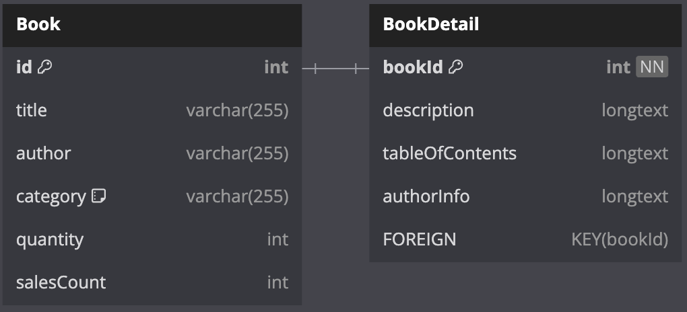

# 온라인 서점 북북

## URL

배포 url - https://bookstore-project-two.vercel.app/
Github url - https://github.com/Jung-sunghoon/bookstore_project

## 실행 방법

### 프로젝트 클론

git clone https://github.com/Jung-sunghoon/bookstore_project.git

### 의존성 설치

yarn install

### 개발 서버 실행

yarn dev

## 프로젝트 소개

### React, TypeScript로 만드는 온라인 서점 웹 어플리케이션

## 프로젝트 기획

### 간략한 UI / UX 디자인(Figma 제작)

#### 메인 페이지


#### 상세 페이지


### 간단한 ERD 다이어그램

#### dbml 문법으로 작성한 스키마

```dbml
TABLE Book {
  id int [pk,increment]
  title varchar(255)
  author varchar(255)
  category varchar(255) [note: "도서 카테고리"]
  quantity int
  salesCount int
}

TABLE BookDetail {
  bookId int [pk,not null]
  description longtext
  tableOfContents longtext
  authorInfo longtext
  FOREIGN KEY (bookId)
}

Ref: Book.id - BookDetail.bookId [delete: cascade]
```

#### ERD 다이어그램



### 프로젝트 진행 계획

#### 데이터 통신

mock data를 사용하여 구현

#### 이미지 관리

https://picsum.photos/ 를 활용한 랜덤이미지
오류로 인해 이미지가 불러와지지 않을 경우 https://dummyimage.com/50x70/cccccc/ffffff.png&text=Book
에서 불러온 더미 book 이미지 사용

#### 개발 환경 / 기술 스택

- React: UI를 구성하는 라이브러리
- TypeScript: 정적 타입 언어로 코드의 안정성 및 가독성을 향상
- Vite: 빠른 빌드와 HMR을 제공하는 개발 도구
- React Router: 라우팅 처리 라이브러리
- Ant Design: UI 컴포넌트 라이브러리
- Figma: UI/UX 디자인 툴
- css module: 컴포넌트 간 간섭없는 독립적인 css 스타일링
- Chrome에서 동작

#### 배포

vercel을 통해 배포
https://vercel.com/

## 프로젝트 이미지

### 메인 페이지


### 메인 페이지 로딩 화면

스켈레톤 UI를 활용하여 로딩하는 화면을 직관적으로 표현


### 페이지네이션(10개 씩)


### 검색 화면


### 검색 결과 화면


### 디테일 페이지


### 디테일 페이지 로딩 화면

스켈레톤 UI를 활용하여 로딩하는 화면을 직관적으로 표현


## 아쉬운 점

- PR도 해보고 싶었으나 짧은 시간이기도 했고 많은 작업을 한 후 조금씩 더 고치고 하는 방법 때문에 제대로 하지 못 함.
- 기본적인 기능 및 화면 구현에 초점을 맞췄기 때문에 성능 최적화까지 하지 못 함.
- mock 데이터로 진행하였기 때문에 백엔드와 REST API 통신을 하지 못하였고 기능을 전부 구현하지 못 함.

## 잘 한 점

- 폴더를 기능 별로 구조화 하여 직관적이인 폴더 구조를 짤 수 있었고 작업 속도가 향상되고 가독성이 좋아짐.
- module css를 활용하여 컴포넌트 간 간섭없이 독립적인 스타일링이 가능하게 함.
- 컴포넌트 단위로 분리할 수 있는 것들은 분리하여 가독성과 재사용성을 높임.
- README.md의 중요성을 깨닫고 그 깨달음을 잘 녹여냄.

## 추가할 것

- mock 데이터를 고도화 시키고 json-server를 활용해서 로컬이지만 REST API 통신 처리해보기
- 최적화(memo, useMemo, useCallback 등) 활용해보기
- node.js를 활용하여 백엔드 API 구축 후 프론트엔드와 진짜 REST API 통신 처리해보기
